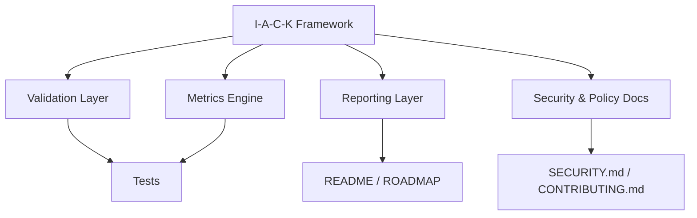


<html xmlns:v="urn:schemas-microsoft-com:vml"
xmlns:o="urn:schemas-microsoft-com:office:office"
xmlns:w="urn:schemas-microsoft-com:office:word"
xmlns:dt="uuid:C2F41010-65B3-11d1-A29F-00AA00C14882"
xmlns:m="http://schemas.microsoft.com/office/2004/12/omml"
xmlns="http://www.w3.org/TR/REC-html40">

<head>
<meta http-equiv=Content-Type content="text/html; charset=windows-1252">
<meta name=ProgId content=Word.Document>
<meta name=Generator content="Microsoft Word 15">
<meta name=Originator content="Microsoft Word 15">
<link rel=File-List href="README_files/filelist.xml">
<!--[if gte mso 9]><xml>
 <o:DocumentProperties>
  <o:Author>Felix Cepeda</o:Author>
  <o:LastAuthor>Felix Cepeda</o:LastAuthor>
  <o:Revision>2</o:Revision>
  <o:TotalTime>0</o:TotalTime>
  <o:Created>2026-05-02T23:04:00Z</o:Created>
  <o:LastSaved>2026-05-02T23:04:00Z</o:LastSaved>
  <o:Pages>3</o:Pages>
  <o:Words>1429</o:Words>
  <o:Characters>8147</o:Characters>
  <o:Lines>67</o:Lines>
  <o:Paragraphs>19</o:Paragraphs>
  <o:CharactersWithSpaces>9557</o:CharactersWithSpaces>
  <o:Version>16.00</o:Version>
 </o:DocumentProperties>
 <o:CustomDocumentProperties>
  <o:GrammarlyDocumentId dt:dt="string">fd94242e-4a17-422d-8081-7d657274c975</o:GrammarlyDocumentId>
 </o:CustomDocumentProperties>
 <o:OfficeDocumentSettings>
  <o:AllowPNG/>
 </o:OfficeDocumentSettings>
</xml><![endif]-->
<link rel=themeData href="README_files/themedata.thmx">
<link rel=colorSchemeMapping href="README_files/colorschememapping.xml">
<!--[if gte mso 9]><xml>
 <w:WordDocument>
  <w:View>Print</w:View>
  <w:SpellingState>Clean</w:SpellingState>
  <w:GrammarState>Clean</w:GrammarState>
  <w:TrackMoves>false</w:TrackMoves>
  <w:TrackFormatting/>
  <w:ValidateAgainstSchemas/>
  <w:SaveIfXMLInvalid>false</w:SaveIfXMLInvalid>
  <w:IgnoreMixedContent>false</w:IgnoreMixedContent>
  <w:AlwaysShowPlaceholderText>false</w:AlwaysShowPlaceholderText>
  <w:DoNotPromoteQF/>
  <w:LidThemeOther>EN-CA</w:LidThemeOther>
  <w:LidThemeAsian>X-NONE</w:LidThemeAsian>
  <w:LidThemeComplexScript>X-NONE</w:LidThemeComplexScript>
  <w:Compatibility>
   <w:BreakWrappedTables/>
   <w:SplitPgBreakAndParaMark/>
  </w:Compatibility>
  <m:mathPr>
   <m:mathFont m:val="Cambria Math"/>
   <m:brkBin m:val="before"/>
   <m:brkBinSub m:val="&#45;-"/>
   <m:smallFrac m:val="off"/>
   <m:dispDef/>
   <m:lMargin m:val="0"/>
   <m:rMargin m:val="0"/>
   <m:defJc m:val="centerGroup"/>
   <m:wrapIndent m:val="1440"/>
   <m:intLim m:val="subSup"/>
   <m:naryLim m:val="undOvr"/>
  </m:mathPr></w:WordDocument>
</xml><![endif]--><!--[if gte mso 9]><xml>
 <w:LatentStyles DefLockedState="false" DefUnhideWhenUsed="false"
  DefSemiHidden="false" DefQFormat="false" DefPriority="99"
  LatentStyleCount="376">
  <w:LsdException Locked="false" Priority="0" QFormat="true" Name="Normal"/>
  <w:LsdException Locked="false" Priority="9" QFormat="true" Name="heading 1"/>
  <w:LsdException Locked="false" Priority="9" SemiHidden="true"
   UnhideWhenUsed="true" QFormat="true" Name="heading 2"/>
  <w:LsdException Locked="false" Priority="9" SemiHidden="true"
   UnhideWhenUsed="true" QFormat="true" Name="heading 3"/>
  <w:LsdException Locked="false" Priority="9" SemiHidden="true"
   UnhideWhenUsed="true" QFormat="true" Name="heading 4"/>
  <w:LsdException Locked="false" Priority="9" SemiHidden="true"
   UnhideWhenUsed="true" QFormat="true" Name="heading 5"/>
  <w:LsdException Locked="false" Priority="9" SemiHidden="true"
   UnhideWhenUsed="true" QFormat="true" Name="heading 6"/>
  <w:LsdException Locked="false" Priority="9" SemiHidden="true"
   UnhideWhenUsed="true" QFormat="true" Name="heading 7"/>
  <w:LsdException Locked="false" Priority="9" SemiHidden="true"
   UnhideWhenUsed="true" QFormat="true" Name="heading 8"/>
  <w:LsdException Locked="false" Priority="9" SemiHidden="true"
   UnhideWhenUsed="true" QFormat="true" Name="heading 9"/>
  <w:LsdException Locked="false" SemiHidden="true" UnhideWhenUsed="true"
   Name="index 1"/>
  <w:LsdException Locked="false" SemiHidden="true" UnhideWhenUsed="true"
   Name="index 2"/>
  <w:LsdException Locked="false" SemiHidden="true" UnhideWhenUsed="true"
   Name="index 3"/>
  <w:LsdException Locked="false" SemiHidden="true" UnhideWhenUsed="true"
   Name="index 4"/>
  <w:LsdException Locked="false" SemiHidden="true" UnhideWhenUsed="true"
   Name="index 5"/>
  <w:LsdException Locked="false" SemiHidden="true" UnhideWhenUsed="true"
   Name="index 6"/>
  <w:LsdException Locked="false" SemiHidden="true" UnhideWhenUsed="true"
   Name="index 7"/>
  <w:LsdException Locked="false" SemiHidden="true" UnhideWhenUsed="true"
   Name="index 8"/>
  <w:LsdException Locked="false" SemiHidden="true" UnhideWhenUsed="true"
   Name="index 9"/>
  <w:LsdException Locked="false" Priority="39" SemiHidden="true"
   UnhideWhenUsed="true" Name="toc 1"/>
  <w:LsdException Locked="false" Priority="39" SemiHidden="true"
   UnhideWhenUsed="true" Name="toc 2"/>
  <w:LsdException Locked="false" Priority="39" SemiHidden="true"
   UnhideWhenUsed="true" Name="toc 3"/>
  <w:LsdException Locked="false" Priority="39" SemiHidden="true"
   UnhideWhenUsed="true" Name="toc 4"/>
  <w:LsdException Locked="false" Priority="39" SemiHidden="true"
   UnhideWhenUsed="true" Name="toc 5"/>
  <w:LsdException Locked="false" Priority="39" SemiHidden="true"
   UnhideWhenUsed="true" Name="toc 6"/>
  <w:LsdException Locked="false" Priority="39" SemiHidden="true"
   UnhideWhenUsed="true" Name="toc 7"/>
  <w:LsdException Locked="false" Priority="39" SemiHidden="true"
   UnhideWhenUsed="true" Name="toc 8"/>
  <w:LsdException Locked="false" Priority="39" SemiHidden="true"
   UnhideWhenUsed="true" Name="toc 9"/>
  <w:LsdException Locked="false" SemiHidden="true" UnhideWhenUsed="true"
   Name="Normal Indent"/>
  <w:LsdException Locked="false" SemiHidden="true" UnhideWhenUsed="true"
   Name="footnote text"/>
  <w:LsdException Locked="false" SemiHidden="true" UnhideWhenUsed="true"
   Name="annotation text"/>
  <w:LsdException Locked="false" SemiHidden="true" UnhideWhenUsed="true"
   Name="header"/>
  <w:LsdException Locked="false" SemiHidden="true" UnhideWhenUsed="true"
   Name="footer"/>
  <w:LsdException Locked="false" SemiHidden="true" UnhideWhenUsed="true"
   Name="index heading"/>
  <w:LsdException Locked="false" Priority="35" SemiHidden="true"
   UnhideWhenUsed="true" QFormat="true" Name="caption"/>
  <w:LsdException Locked="false" SemiHidden="true" UnhideWhenUsed="true"
   Name="table of figures"/>
  <w:LsdException Locked="false" SemiHidden="true" UnhideWhenUsed="true"
   Name="envelope address"/>
  <w:LsdException Locked="false" SemiHidden="true" UnhideWhenUsed="true"
   Name="envelope return"/>
  <w:LsdException Locked="false" SemiHidden="true" UnhideWhenUsed="true"
   Name="footnote reference"/>
  <w:LsdException Locked="false" SemiHidden="true" UnhideWhenUsed="true"
   Name="annotation reference"/>
  <w:LsdException Locked="false" SemiHidden="true" UnhideWhenUsed="true"
   Name="line number"/>
  <w:LsdException Locked="false" SemiHidden="true" UnhideWhenUsed="true"
   Name="page number"/>
  <w:LsdException Locked="false" SemiHidden="true" UnhideWhenUsed="true"
   Name="endnote reference"/>
  <w:LsdException Locked="false" SemiHidden="true" UnhideWhenUsed="true"
   Name="endnote text"/>
  <w:LsdException Locked="false" SemiHidden="true" UnhideWhenUsed="true"
   Name="table of authorities"/>
  <w:LsdException Locked="false" SemiHidden="true" UnhideWhenUsed="true"
   Name="macro"/>
  <w:LsdException Locked="false" SemiHidden="true" UnhideWhenUsed="true"
   Name="toa heading"/>
  <w:LsdException Locked="false" SemiHidden="true" UnhideWhenUsed="true"
   Name="List"/>
  <w:LsdException Locked="false" SemiHidden="true" UnhideWhenUsed="true"
   Name="List Bullet"/>
  <w:LsdException Locked="false" SemiHidden="true" UnhideWhenUsed="true"
   Name="List Number"/>
  <w:LsdException Locked="false" SemiHidden="true" UnhideWhenUsed="true"
   Name="List 2"/>
  <w:LsdException Locked="false" SemiHidden="true" UnhideWhenUsed="true"
   Name="List 3"/>
  <w:LsdException Locked="false" SemiHidden="true" UnhideWhenUsed="true"
   Name="List 4"/>
  <w:LsdException Locked="false" SemiHidden="true" UnhideWhenUsed="true"
   Name="List 5"/>
  <w:LsdException Locked="false" SemiHidden="true" UnhideWhenUsed="true"
   Name="List Bullet 2"/>
  <w:LsdException Locked="false" SemiHidden="true" UnhideWhenUsed="true"
   Name="List Bullet 3"/>
  <w:LsdException Locked="false" SemiHidden="true" UnhideWhenUsed="true"
   Name="List Bullet 4"/>
  <w:LsdException Locked="false" SemiHidden="true" UnhideWhenUsed="true"
   Name="List Bullet 5"/>
  <w:LsdException Locked="false" SemiHidden="true" UnhideWhenUsed="true"
   Name="List Number 2"/>
  <w:LsdException Locked="false" SemiHidden="true" UnhideWhenUsed="true"
   Name="List Number 3"/>
  <w:LsdException Locked="false" SemiHidden="true" UnhideWhenUsed="true"
   Name="List Number 4"/>
  <w:LsdException Locked="false" SemiHidden="true" UnhideWhenUsed="true"
   Name="List Number 5"/>
  <w:LsdException Locked="false" Priority="10" QFormat="true" Name="Title"/>
  <w:LsdException Locked="false" SemiHidden="true" UnhideWhenUsed="true"
   Name="Closing"/>
  <w:LsdException Locked="false" SemiHidden="true" UnhideWhenUsed="true"
   Name="Signature"/>
  <w:LsdException Locked="false" Priority="1" SemiHidden="true"
   UnhideWhenUsed="true" Name="Default Paragraph Font"/>
  <w:LsdException Locked="false" SemiHidden="true" UnhideWhenUsed="true"
   Name="Body Text"/>
  <w:LsdException Locked="false" SemiHidden="true" UnhideWhenUsed="true"
   Name="Body Text Indent"/>
  <w:LsdException Locked="false" SemiHidden="true" UnhideWhenUsed="true"
   Name="List Continue"/>
  <w:LsdException Locked="false" SemiHidden="true" UnhideWhenUsed="true"
   Name="List Continue 2"/>
  <w:LsdException Locked="false" SemiHidden="true" UnhideWhenUsed="true"
   Name="List Continue 3"/>
  <w:LsdException Locked="false" SemiHidden="true" UnhideWhenUsed="true"
   Name="List Continue 4"/>
  <w:LsdException Locked="false" SemiHidden="true" UnhideWhenUsed="true"
   Name="List Continue 5"/>
  <w:LsdException Locked="false" SemiHidden="true" UnhideWhenUsed="true"
   Name="Message Header"/>
  <w:LsdException Locked="false" Priority="11" QFormat="true" Name="Subtitle"/>
  <w:LsdException Locked="false" SemiHidden="true" UnhideWhenUsed="true"
   Name="Salutation"/>
  <w:LsdException Locked="false" SemiHidden="true" UnhideWhenUsed="true"
   Name="Date"/>
  <w:LsdException Locked="false" SemiHidden="true" UnhideWhenUsed="true"
   Name="Body Text First Indent"/>
  <w:LsdException Locked="false" SemiHidden="true" UnhideWhenUsed="true"
   Name="Body Text First Indent 2"/>
  <w:LsdException Locked="false" SemiHidden="true" UnhideWhenUsed="true"
   Name="Note Heading"/>
  <w:LsdException Locked="false" SemiHidden="true" UnhideWhenUsed="true"
   Name="Body Text 2"/>
  <w:LsdException Locked="false" SemiHidden="true" UnhideWhenUsed="true"
   Name="Body Text 3"/>
  <w:LsdException Locked="false" SemiHidden="true" UnhideWhenUsed="true"
   Name="Body Text Indent 2"/>
  <w:LsdException Locked="false" SemiHidden="true" UnhideWhenUsed="true"
   Name="Body Text Indent 3"/>
  <w:LsdException Locked="false" SemiHidden="true" UnhideWhenUsed="true"
   Name="Block Text"/>
  <w:LsdException Locked="false" SemiHidden="true" UnhideWhenUsed="true"
   Name="Hyperlink"/>
  <w:LsdException Locked="false" SemiHidden="true" UnhideWhenUsed="true"
   Name="FollowedHyperlink"/>
  <w:LsdException Locked="false" Priority="22" QFormat="true" Name="Strong"/>
  <w:LsdException Locked="false" Priority="20" QFormat="true" Name="Emphasis"/>
  <w:LsdException Locked="false" SemiHidden="true" UnhideWhenUsed="true"
   Name="Document Map"/>
  <w:LsdException Locked="false" SemiHidden="true" UnhideWhenUsed="true"
   Name="Plain Text"/>
  <w:LsdException Locked="false" SemiHidden="true" UnhideWhenUsed="true"
   Name="E-mail Signature"/>
  <w:LsdException Locked="false" SemiHidden="true" UnhideWhenUsed="true"
   Name="HTML Top of Form"/>
  <w:LsdException Locked="false" SemiHidden="true" UnhideWhenUsed="true"
   Name="HTML Bottom of Form"/>
  <w:LsdException Locked="false" SemiHidden="true" UnhideWhenUsed="true"
   Name="Normal (Web)"/>
  <w:LsdException Locked="false" SemiHidden="true" UnhideWhenUsed="true"
   Name="HTML Acronym"/>
  <w:LsdException Locked="false" SemiHidden="true" UnhideWhenUsed="true"
   Name="HTML Address"/>
  <w:LsdException Locked="false" SemiHidden="true" UnhideWhenUsed="true"
   Name="HTML Cite"/>
  <w:LsdException Locked="false" SemiHidden="true" UnhideWhenUsed="true"
   Name="HTML Code"/>
  <w:LsdException Locked="false" SemiHidden="true" UnhideWhenUsed="true"
   Name="HTML Definition"/>
  <w:LsdException Locked="false" SemiHidden="true" UnhideWhenUsed="true"
   Name="HTML Keyboard"/>
  <w:LsdException Locked="false" SemiHidden="true" UnhideWhenUsed="true"
   Name="HTML Preformatted"/>
  <w:LsdException Locked="false" SemiHidden="true" UnhideWhenUsed="true"
   Name="HTML Sample"/>
  <w:LsdException Locked="false" SemiHidden="true" UnhideWhenUsed="true"
   Name="HTML Typewriter"/>
  <w:LsdException Locked="false" SemiHidden="true" UnhideWhenUsed="true"
   Name="HTML Variable"/>
  <w:LsdException Locked="false" SemiHidden="true" UnhideWhenUsed="true"
   Name="Normal Table"/>
  <w:LsdException Locked="false" SemiHidden="true" UnhideWhenUsed="true"
   Name="annotation subject"/>
  <w:LsdException Locked="false" SemiHidden="true" UnhideWhenUsed="true"
   Name="No List"/>
  <w:LsdException Locked="false" SemiHidden="true" UnhideWhenUsed="true"
   Name="Outline List 1"/>
  <w:LsdException Locked="false" SemiHidden="true" UnhideWhenUsed="true"
   Name="Outline List 2"/>
  <w:LsdException Locked="false" SemiHidden="true" UnhideWhenUsed="true"
   Name="Outline List 3"/>
  <w:LsdException Locked="false" SemiHidden="true" UnhideWhenUsed="true"
   Name="Table Simple 1"/>
  <w:LsdException Locked="false" SemiHidden="true" UnhideWhenUsed="true"
   Name="Table Simple 2"/>
  <w:LsdException Locked="false" SemiHidden="true" UnhideWhenUsed="true"
   Name="Table Simple 3"/>
  <w:LsdException Locked="false" SemiHidden="true" UnhideWhenUsed="true"
   Name="Table Classic 1"/>
  <w:LsdException Locked="false" SemiHidden="true" UnhideWhenUsed="true"
   Name="Table Classic 2"/>
  <w:LsdException Locked="false" SemiHidden="true" UnhideWhenUsed="true"
   Name="Table Classic 3"/>
  <w:LsdException Locked="false" SemiHidden="true" UnhideWhenUsed="true"
   Name="Table Classic 4"/>
  <w:LsdException Locked="false" SemiHidden="true" UnhideWhenUsed="true"
   Name="Table Colorful 1"/>
  <w:LsdException Locked="false" SemiHidden="true" UnhideWhenUsed="true"
   Name="Table Colorful 2"/>
  <w:LsdException Locked="false" SemiHidden="true" UnhideWhenUsed="true"
   Name="Table Colorful 3"/>
  <w:LsdException Locked="false" SemiHidden="true" UnhideWhenUsed="true"
   Name="Table Columns 1"/>
  <w:LsdException Locked="false" SemiHidden="true" UnhideWhenUsed="true"
   Name="Table Columns 2"/>
  <w:LsdException Locked="false" SemiHidden="true" UnhideWhenUsed="true"
   Name="Table Columns 3"/>
  <w:LsdException Locked="false" SemiHidden="true" UnhideWhenUsed="true"
   Name="Table Columns 4"/>
  <w:LsdException Locked="false" SemiHidden="true" UnhideWhenUsed="true"
   Name="Table Columns 5"/>
  <w:LsdException Locked="false" SemiHidden="true" UnhideWhenUsed="true"
   Name="Table Grid 1"/>
  <w:LsdException Locked="false" SemiHidden="true" UnhideWhenUsed="true"
   Name="Table Grid 2"/>
  <w:LsdException Locked="false" SemiHidden="true" UnhideWhenUsed="true"
   Name="Table Grid 3"/>
  <w:LsdException Locked="false" SemiHidden="true" UnhideWhenUsed="true"
   Name="Table Grid 4"/>
  <w:LsdException Locked="false" SemiHidden="true" UnhideWhenUsed="true"
   Name="Table Grid 5"/>
  <w:LsdException Locked="false" SemiHidden="true" UnhideWhenUsed="true"
   Name="Table Grid 6"/>
  <w:LsdException Locked="false" SemiHidden="true" UnhideWhenUsed="true"
   Name="Table Grid 7"/>
  <w:LsdException Locked="false" SemiHidden="true" UnhideWhenUsed="true"
   Name="Table Grid 8"/>
  <w:LsdException Locked="false" SemiHidden="true" UnhideWhenUsed="true"
   Name="Table List 1"/>
  <w:LsdException Locked="false" SemiHidden="true" UnhideWhenUsed="true"
   Name="Table List 2"/>
  <w:LsdException Locked="false" SemiHidden="true" UnhideWhenUsed="true"
   Name="Table List 3"/>
  <w:LsdException Locked="false" SemiHidden="true" UnhideWhenUsed="true"
   Name="Table List 4"/>
  <w:LsdException Locked="false" SemiHidden="true" UnhideWhenUsed="true"
   Name="Table List 5"/>
  <w:LsdException Locked="false" SemiHidden="true" UnhideWhenUsed="true"
   Name="Table List 6"/>
  <w:LsdException Locked="false" SemiHidden="true" UnhideWhenUsed="true"
   Name="Table List 7"/>
  <w:LsdException Locked="false" SemiHidden="true" UnhideWhenUsed="true"
   Name="Table List 8"/>
  <w:LsdException Locked="false" SemiHidden="true" UnhideWhenUsed="true"
   Name="Table 3D effects 1"/>
  <w:LsdException Locked="false" SemiHidden="true" UnhideWhenUsed="true"
   Name="Table 3D effects 2"/>
  <w:LsdException Locked="false" SemiHidden="true" UnhideWhenUsed="true"
   Name="Table 3D effects 3"/>
  <w:LsdException Locked="false" SemiHidden="true" UnhideWhenUsed="true"
   Name="Table Contemporary"/>
  <w:LsdException Locked="false" SemiHidden="true" UnhideWhenUsed="true"
   Name="Table Elegant"/>
  <w:LsdException Locked="false" SemiHidden="true" UnhideWhenUsed="true"
   Name="Table Professional"/>
  <w:LsdException Locked="false" SemiHidden="true" UnhideWhenUsed="true"
   Name="Table Subtle 1"/>
  <w:LsdException Locked="false" SemiHidden="true" UnhideWhenUsed="true"
   Name="Table Subtle 2"/>
  <w:LsdException Locked="false" SemiHidden="true" UnhideWhenUsed="true"
   Name="Table Web 1"/>
  <w:LsdException Locked="false" SemiHidden="true" UnhideWhenUsed="true"
   Name="Table Web 2"/>
  <w:LsdException Locked="false" SemiHidden="true" UnhideWhenUsed="true"
   Name="Table Web 3"/>
  <w:LsdException Locked="false" SemiHidden="true" UnhideWhenUsed="true"
   Name="Balloon Text"/>
  <w:LsdException Locked="false" Priority="39" Name="Table Grid"/>
  <w:LsdException Locked="false" SemiHidden="true" UnhideWhenUsed="true"
   Name="Table Theme"/>
  <w:LsdException Locked="false" SemiHidden="true" Name="Placeholder Text"/>
  <w:LsdException Locked="false" Priority="1" QFormat="true" Name="No Spacing"/>
  <w:LsdException Locked="false" Priority="60" Name="Light Shading"/>
  <w:LsdException Locked="false" Priority="61" Name="Light List"/>
  <w:LsdException Locked="false" Priority="62" Name="Light Grid"/>
  <w:LsdException Locked="false" Priority="63" Name="Medium Shading 1"/>
  <w:LsdException Locked="false" Priority="64" Name="Medium Shading 2"/>
  <w:LsdException Locked="false" Priority="65" Name="Medium List 1"/>
  <w:LsdException Locked="false" Priority="66" Name="Medium List 2"/>
  <w:LsdException Locked="false" Priority="67" Name="Medium Grid 1"/>
  <w:LsdException Locked="false" Priority="68" Name="Medium Grid 2"/>
  <w:LsdException Locked="false" Priority="69" Name="Medium Grid 3"/>
  <w:LsdException Locked="false" Priority="70" Name="Dark List"/>
  <w:LsdException Locked="false" Priority="71" Name="Colorful Shading"/>
  <w:LsdException Locked="false" Priority="72" Name="Colorful List"/>
  <w:LsdException Locked="false" Priority="73" Name="Colorful Grid"/>
  <w:LsdException Locked="false" Priority="60" Name="Light Shading Accent 1"/>
  <w:LsdException Locked="false" Priority="61" Name="Light List Accent 1"/>
  <w:LsdException Locked="false" Priority="62" Name="Light Grid Accent 1"/>
  <w:LsdException Locked="false" Priority="63" Name="Medium Shading 1 Accent 1"/>
  <w:LsdException Locked="false" Priority="64" Name="Medium Shading 2 Accent 1"/>
  <w:LsdException Locked="false" Priority="65" Name="Medium List 1 Accent 1"/>
  <w:LsdException Locked="false" SemiHidden="true" Name="Revision"/>
  <w:LsdException Locked="false" Priority="34" QFormat="true"
   Name="List Paragraph"/>
  <w:LsdException Locked="false" Priority="29" QFormat="true" Name="Quote"/>
  <w:LsdException Locked="false" Priority="30" QFormat="true"
   Name="Intense Quote"/>
  <w:LsdException Locked="false" Priority="66" Name="Medium List 2 Accent 1"/>
  <w:LsdException Locked="false" Priority="67" Name="Medium Grid 1 Accent 1"/>
  <w:LsdException Locked="false" Priority="68" Name="Medium Grid 2 Accent 1"/>
  <w:LsdException Locked="false" Priority="69" Name="Medium Grid 3 Accent 1"/>
  <w:LsdException Locked="false" Priority="70" Name="Dark List Accent 1"/>
  <w:LsdException Locked="false" Priority="71" Name="Colorful Shading Accent 1"/>
  <w:LsdException Locked="false" Priority="72" Name="Colorful List Accent 1"/>
  <w:LsdException Locked="false" Priority="73" Name="Colorful Grid Accent 1"/>
  <w:LsdException Locked="false" Priority="60" Name="Light Shading Accent 2"/>
  <w:LsdException Locked="false" Priority="61" Name="Light List Accent 2"/>
  <w:LsdException Locked="false" Priority="62" Name="Light Grid Accent 2"/>
  <w:LsdException Locked="false" Priority="63" Name="Medium Shading 1 Accent 2"/>
  <w:LsdException Locked="false" Priority="64" Name="Medium Shading 2 Accent 2"/>
  <w:LsdException Locked="false" Priority="65" Name="Medium List 1 Accent 2"/>
  <w:LsdException Locked="false" Priority="66" Name="Medium List 2 Accent 2"/>
  <w:LsdException Locked="false" Priority="67" Name="Medium Grid 1 Accent 2"/>
  <w:LsdException Locked="false" Priority="68" Name="Medium Grid 2 Accent 2"/>
  <w:LsdException Locked="false" Priority="69" Name="Medium Grid 3 Accent 2"/>
  <w:LsdException Locked="false" Priority="70" Name="Dark List Accent 2"/>
  <w:LsdException Locked="false" Priority="71" Name="Colorful Shading Accent 2"/>
  <w:LsdException Locked="false" Priority="72" Name="Colorful List Accent 2"/>
  <w:LsdException Locked="false" Priority="73" Name="Colorful Grid Accent 2"/>
  <w:LsdException Locked="false" Priority="60" Name="Light Shading Accent 3"/>
  <w:LsdException Locked="false" Priority="61" Name="Light List Accent 3"/>
  <w:LsdException Locked="false" Priority="62" Name="Light Grid Accent 3"/>
  <w:LsdException Locked="false" Priority="63" Name="Medium Shading 1 Accent 3"/>
  <w:LsdException Locked="false" Priority="64" Name="Medium Shading 2 Accent 3"/>
  <w:LsdException Locked="false" Priority="65" Name="Medium List 1 Accent 3"/>
  <w:LsdException Locked="false" Priority="66" Name="Medium List 2 Accent 3"/>
  <w:LsdException Locked="false" Priority="67" Name="Medium Grid 1 Accent 3"/>
  <w:LsdException Locked="false" Priority="68" Name="Medium Grid 2 Accent 3"/>
  <w:LsdException Locked="false" Priority="69" Name="Medium Grid 3 Accent 3"/>
  <w:LsdException Locked="false" Priority="70" Name="Dark List Accent 3"/>
  <w:LsdException Locked="false" Priority="71" Name="Colorful Shading Accent 3"/>
  <w:LsdException Locked="false" Priority="72" Name="Colorful List Accent 3"/>
  <w:LsdException Locked="false" Priority="73" Name="Colorful Grid Accent 3"/>
  <w:LsdException Locked="false" Priority="60" Name="Light Shading Accent 4"/>
  <w:LsdException Locked="false" Priority="61" Name="Light List Accent 4"/>
  <w:LsdException Locked="false" Priority="62" Name="Light Grid Accent 4"/>
  <w:LsdException Locked="false" Priority="63" Name="Medium Shading 1 Accent 4"/>
  <w:LsdException Locked="false" Priority="64" Name="Medium Shading 2 Accent 4"/>
  <w:LsdException Locked="false" Priority="65" Name="Medium List 1 Accent 4"/>
  <w:LsdException Locked="false" Priority="66" Name="Medium List 2 Accent 4"/>
  <w:LsdException Locked="false" Priority="67" Name="Medium Grid 1 Accent 4"/>
  <w:LsdException Locked="false" Priority="68" Name="Medium Grid 2 Accent 4"/>
  <w:LsdException Locked="false" Priority="69" Name="Medium Grid 3 Accent 4"/>
  <w:LsdException Locked="false" Priority="70" Name="Dark List Accent 4"/>
  <w:LsdException Locked="false" Priority="71" Name="Colorful Shading Accent 4"/>
  <w:LsdException Locked="false" Priority="72" Name="Colorful List Accent 4"/>
  <w:LsdException Locked="false" Priority="73" Name="Colorful Grid Accent 4"/>
  <w:LsdException Locked="false" Priority="60" Name="Light Shading Accent 5"/>
  <w:LsdException Locked="false" Priority="61" Name="Light List Accent 5"/>
  <w:LsdException Locked="false" Priority="62" Name="Light Grid Accent 5"/>
  <w:LsdException Locked="false" Priority="63" Name="Medium Shading 1 Accent 5"/>
  <w:LsdException Locked="false" Priority="64" Name="Medium Shading 2 Accent 5"/>
  <w:LsdException Locked="false" Priority="65" Name="Medium List 1 Accent 5"/>
  <w:LsdException Locked="false" Priority="66" Name="Medium List 2 Accent 5"/>
  <w:LsdException Locked="false" Priority="67" Name="Medium Grid 1 Accent 5"/>
  <w:LsdException Locked="false" Priority="68" Name="Medium Grid 2 Accent 5"/>
  <w:LsdException Locked="false" Priority="69" Name="Medium Grid 3 Accent 5"/>
  <w:LsdException Locked="false" Priority="70" Name="Dark List Accent 5"/>
  <w:LsdException Locked="false" Priority="71" Name="Colorful Shading Accent 5"/>
  <w:LsdException Locked="false" Priority="72" Name="Colorful List Accent 5"/>
  <w:LsdException Locked="false" Priority="73" Name="Colorful Grid Accent 5"/>
  <w:LsdException Locked="false" Priority="60" Name="Light Shading Accent 6"/>
  <w:LsdException Locked="false" Priority="61" Name="Light List Accent 6"/>
  <w:LsdException Locked="false" Priority="62" Name="Light Grid Accent 6"/>
  <w:LsdException Locked="false" Priority="63" Name="Medium Shading 1 Accent 6"/>
  <w:LsdException Locked="false" Priority="64" Name="Medium Shading 2 Accent 6"/>
  <w:LsdException Locked="false" Priority="65" Name="Medium List 1 Accent 6"/>
  <w:LsdException Locked="false" Priority="66" Name="Medium List 2 Accent 6"/>
  <w:LsdException Locked="false" Priority="67" Name="Medium Grid 1 Accent 6"/>
  <w:LsdException Locked="false" Priority="68" Name="Medium Grid 2 Accent 6"/>
  <w:LsdException Locked="false" Priority="69" Name="Medium Grid 3 Accent 6"/>
  <w:LsdException Locked="false" Priority="70" Name="Dark List Accent 6"/>
  <w:LsdException Locked="false" Priority="71" Name="Colorful Shading Accent 6"/>
  <w:LsdException Locked="false" Priority="72" Name="Colorful List Accent 6"/>
  <w:LsdException Locked="false" Priority="73" Name="Colorful Grid Accent 6"/>
  <w:LsdException Locked="false" Priority="19" QFormat="true"
   Name="Subtle Emphasis"/>
  <w:LsdException Locked="false" Priority="21" QFormat="true"
   Name="Intense Emphasis"/>
  <w:LsdException Locked="false" Priority="31" QFormat="true"
   Name="Subtle Reference"/>
  <w:LsdException Locked="false" Priority="32" QFormat="true"
   Name="Intense Reference"/>
  <w:LsdException Locked="false" Priority="33" QFormat="true" Name="Book Title"/>
  <w:LsdException Locked="false" Priority="37" SemiHidden="true"
   UnhideWhenUsed="true" Name="Bibliography"/>
  <w:LsdException Locked="false" Priority="39" SemiHidden="true"
   UnhideWhenUsed="true" QFormat="true" Name="TOC Heading"/>
  <w:LsdException Locked="false" Priority="41" Name="Plain Table 1"/>
  <w:LsdException Locked="false" Priority="42" Name="Plain Table 2"/>
  <w:LsdException Locked="false" Priority="43" Name="Plain Table 3"/>
  <w:LsdException Locked="false" Priority="44" Name="Plain Table 4"/>
  <w:LsdException Locked="false" Priority="45" Name="Plain Table 5"/>
  <w:LsdException Locked="false" Priority="40" Name="Grid Table Light"/>
  <w:LsdException Locked="false" Priority="46" Name="Grid Table 1 Light"/>
  <w:LsdException Locked="false" Priority="47" Name="Grid Table 2"/>
  <w:LsdException Locked="false" Priority="48" Name="Grid Table 3"/>
  <w:LsdException Locked="false" Priority="49" Name="Grid Table 4"/>
  <w:LsdException Locked="false" Priority="50" Name="Grid Table 5 Dark"/>
  <w:LsdException Locked="false" Priority="51" Name="Grid Table 6 Colorful"/>
  <w:LsdException Locked="false" Priority="52" Name="Grid Table 7 Colorful"/>
  <w:LsdException Locked="false" Priority="46"
   Name="Grid Table 1 Light Accent 1"/>
  <w:LsdException Locked="false" Priority="47" Name="Grid Table 2 Accent 1"/>
  <w:LsdException Locked="false" Priority="48" Name="Grid Table 3 Accent 1"/>
  <w:LsdException Locked="false" Priority="49" Name="Grid Table 4 Accent 1"/>
  <w:LsdException Locked="false" Priority="50" Name="Grid Table 5 Dark Accent 1"/>
  <w:LsdException Locked="false" Priority="51"
   Name="Grid Table 6 Colorful Accent 1"/>
  <w:LsdException Locked="false" Priority="52"
   Name="Grid Table 7 Colorful Accent 1"/>
  <w:LsdException Locked="false" Priority="46"
   Name="Grid Table 1 Light Accent 2"/>
  <w:LsdException Locked="false" Priority="47" Name="Grid Table 2 Accent 2"/>
  <w:LsdException Locked="false" Priority="48" Name="Grid Table 3 Accent 2"/>
  <w:LsdException Locked="false" Priority="49" Name="Grid Table 4 Accent 2"/>
  <w:LsdException Locked="false" Priority="50" Name="Grid Table 5 Dark Accent 2"/>
  <w:LsdException Locked="false" Priority="51"
   Name="Grid Table 6 Colorful Accent 2"/>
  <w:LsdException Locked="false" Priority="52"
   Name="Grid Table 7 Colorful Accent 2"/>
  <w:LsdException Locked="false" Priority="46"
   Name="Grid Table 1 Light Accent 3"/>
  <w:LsdException Locked="false" Priority="47" Name="Grid Table 2 Accent 3"/>
  <w:LsdException Locked="false" Priority="48" Name="Grid Table 3 Accent 3"/>
  <w:LsdException Locked="false" Priority="49" Name="Grid Table 4 Accent 3"/>
  <w:LsdException Locked="false" Priority="50" Name="Grid Table 5 Dark Accent 3"/>
  <w:LsdException Locked="false" Priority="51"
   Name="Grid Table 6 Colorful Accent 3"/>
  <w:LsdException Locked="false" Priority="52"
   Name="Grid Table 7 Colorful Accent 3"/>
  <w:LsdException Locked="false" Priority="46"
   Name="Grid Table 1 Light Accent 4"/>
  <w:LsdException Locked="false" Priority="47" Name="Grid Table 2 Accent 4"/>
  <w:LsdException Locked="false" Priority="48" Name="Grid Table 3 Accent 4"/>
  <w:LsdException Locked="false" Priority="49" Name="Grid Table 4 Accent 4"/>
  <w:LsdException Locked="false" Priority="50" Name="Grid Table 5 Dark Accent 4"/>
  <w:LsdException Locked="false" Priority="51"
   Name="Grid Table 6 Colorful Accent 4"/>
  <w:LsdException Locked="false" Priority="52"
   Name="Grid Table 7 Colorful Accent 4"/>
  <w:LsdException Locked="false" Priority="46"
   Name="Grid Table 1 Light Accent 5"/>
  <w:LsdException Locked="false" Priority="47" Name="Grid Table 2 Accent 5"/>
  <w:LsdException Locked="false" Priority="48" Name="Grid Table 3 Accent 5"/>
  <w:LsdException Locked="false" Priority="49" Name="Grid Table 4 Accent 5"/>
  <w:LsdException Locked="false" Priority="50" Name="Grid Table 5 Dark Accent 5"/>
  <w:LsdException Locked="false" Priority="51"
   Name="Grid Table 6 Colorful Accent 5"/>
  <w:LsdException Locked="false" Priority="52"
   Name="Grid Table 7 Colorful Accent 5"/>
  <w:LsdException Locked="false" Priority="46"
   Name="Grid Table 1 Light Accent 6"/>
  <w:LsdException Locked="false" Priority="47" Name="Grid Table 2 Accent 6"/>
  <w:LsdException Locked="false" Priority="48" Name="Grid Table 3 Accent 6"/>
  <w:LsdException Locked="false" Priority="49" Name="Grid Table 4 Accent 6"/>
  <w:LsdException Locked="false" Priority="50" Name="Grid Table 5 Dark Accent 6"/>
  <w:LsdException Locked="false" Priority="51"
   Name="Grid Table 6 Colorful Accent 6"/>
  <w:LsdException Locked="false" Priority="52"
   Name="Grid Table 7 Colorful Accent 6"/>
  <w:LsdException Locked="false" Priority="46" Name="List Table 1 Light"/>
  <w:LsdException Locked="false" Priority="47" Name="List Table 2"/>
  <w:LsdException Locked="false" Priority="48" Name="List Table 3"/>
  <w:LsdException Locked="false" Priority="49" Name="List Table 4"/>
  <w:LsdException Locked="false" Priority="50" Name="List Table 5 Dark"/>
  <w:LsdException Locked="false" Priority="51" Name="List Table 6 Colorful"/>
  <w:LsdException Locked="false" Priority="52" Name="List Table 7 Colorful"/>
  <w:LsdException Locked="false" Priority="46"
   Name="List Table 1 Light Accent 1"/>
  <w:LsdException Locked="false" Priority="47" Name="List Table 2 Accent 1"/>
  <w:LsdException Locked="false" Priority="48" Name="List Table 3 Accent 1"/>
  <w:LsdException Locked="false" Priority="49" Name="List Table 4 Accent 1"/>
  <w:LsdException Locked="false" Priority="50" Name="List Table 5 Dark Accent 1"/>
  <w:LsdException Locked="false" Priority="51"
   Name="List Table 6 Colorful Accent 1"/>
  <w:LsdException Locked="false" Priority="52"
   Name="List Table 7 Colorful Accent 1"/>
  <w:LsdException Locked="false" Priority="46"
   Name="List Table 1 Light Accent 2"/>
  <w:LsdException Locked="false" Priority="47" Name="List Table 2 Accent 2"/>
  <w:LsdException Locked="false" Priority="48" Name="List Table 3 Accent 2"/>
  <w:LsdException Locked="false" Priority="49" Name="List Table 4 Accent 2"/>
  <w:LsdException Locked="false" Priority="50" Name="List Table 5 Dark Accent 2"/>
  <w:LsdException Locked="false" Priority="51"
   Name="List Table 6 Colorful Accent 2"/>
  <w:LsdException Locked="false" Priority="52"
   Name="List Table 7 Colorful Accent 2"/>
  <w:LsdException Locked="false" Priority="46"
   Name="List Table 1 Light Accent 3"/>
  <w:LsdException Locked="false" Priority="47" Name="List Table 2 Accent 3"/>
  <w:LsdException Locked="false" Priority="48" Name="List Table 3 Accent 3"/>
  <w:LsdException Locked="false" Priority="49" Name="List Table 4 Accent 3"/>
  <w:LsdException Locked="false" Priority="50" Name="List Table 5 Dark Accent 3"/>
  <w:LsdException Locked="false" Priority="51"
   Name="List Table 6 Colorful Accent 3"/>
  <w:LsdException Locked="false" Priority="52"
   Name="List Table 7 Colorful Accent 3"/>
  <w:LsdException Locked="false" Priority="46"
   Name="List Table 1 Light Accent 4"/>
  <w:LsdException Locked="false" Priority="47" Name="List Table 2 Accent 4"/>
  <w:LsdException Locked="false" Priority="48" Name="List Table 3 Accent 4"/>
  <w:LsdException Locked="false" Priority="49" Name="List Table 4 Accent 4"/>
  <w:LsdException Locked="false" Priority="50" Name="List Table 5 Dark Accent 4"/>
  <w:LsdException Locked="false" Priority="51"
   Name="List Table 6 Colorful Accent 4"/>
  <w:LsdException Locked="false" Priority="52"
   Name="List Table 7 Colorful Accent 4"/>
  <w:LsdException Locked="false" Priority="46"
   Name="List Table 1 Light Accent 5"/>
  <w:LsdException Locked="false" Priority="47" Name="List Table 2 Accent 5"/>
  <w:LsdException Locked="false" Priority="48" Name="List Table 3 Accent 5"/>
  <w:LsdException Locked="false" Priority="49" Name="List Table 4 Accent 5"/>
  <w:LsdException Locked="false" Priority="50" Name="List Table 5 Dark Accent 5"/>
  <w:LsdException Locked="false" Priority="51"
   Name="List Table 6 Colorful Accent 5"/>
  <w:LsdException Locked="false" Priority="52"
   Name="List Table 7 Colorful Accent 5"/>
  <w:LsdException Locked="false" Priority="46"
   Name="List Table 1 Light Accent 6"/>
  <w:LsdException Locked="false" Priority="47" Name="List Table 2 Accent 6"/>
  <w:LsdException Locked="false" Priority="48" Name="List Table 3 Accent 6"/>
  <w:LsdException Locked="false" Priority="49" Name="List Table 4 Accent 6"/>
  <w:LsdException Locked="false" Priority="50" Name="List Table 5 Dark Accent 6"/>
  <w:LsdException Locked="false" Priority="51"
   Name="List Table 6 Colorful Accent 6"/>
  <w:LsdException Locked="false" Priority="52"
   Name="List Table 7 Colorful Accent 6"/>
  <w:LsdException Locked="false" SemiHidden="true" UnhideWhenUsed="true"
   Name="Mention"/>
  <w:LsdException Locked="false" SemiHidden="true" UnhideWhenUsed="true"
   Name="Smart Hyperlink"/>
  <w:LsdException Locked="false" SemiHidden="true" UnhideWhenUsed="true"
   Name="Hashtag"/>
  <w:LsdException Locked="false" SemiHidden="true" UnhideWhenUsed="true"
   Name="Unresolved Mention"/>
  <w:LsdException Locked="false" SemiHidden="true" UnhideWhenUsed="true"
   Name="Smart Link"/>
 </w:LatentStyles>
</xml><![endif]-->
<style>
<!--
 /* Font Definitions */
 @font-face
	{font-family:"Cambria Math";
	panose-1:2 4 5 3 5 4 6 3 2 4;
	mso-font-charset:0;
	mso-generic-font-family:roman;
	mso-font-pitch:variable;
	mso-font-signature:-536869121 1107305727 33554432 0 415 0;}
 /* Style Definitions */
 p.MsoNormal, li.MsoNormal, div.MsoNormal
	{mso-style-unhide:no;
	mso-style-qformat:yes;
	mso-style-parent:"";
	margin:0in;
	mso-pagination:widow-orphan;
	font-size:12.0pt;
	font-family:"Times New Roman",serif;
	mso-fareast-font-family:"Times New Roman";
	mso-fareast-theme-font:minor-fareast;}
p.msonormal0, li.msonormal0, div.msonormal0
	{mso-style-name:msonormal;
	mso-style-unhide:no;
	mso-margin-top-alt:auto;
	margin-right:0in;
	mso-margin-bottom-alt:auto;
	margin-left:0in;
	mso-pagination:widow-orphan;
	font-size:12.0pt;
	font-family:"Times New Roman",serif;
	mso-fareast-font-family:"Times New Roman";
	mso-fareast-theme-font:minor-fareast;}
span.SpellE
	{mso-style-name:"";
	mso-spl-e:yes;}
span.GramE
	{mso-style-name:"";
	mso-gram-e:yes;}
.MsoChpDefault
	{mso-style-type:export-only;
	mso-default-props:yes;
	font-size:10.0pt;
	mso-ansi-font-size:10.0pt;
	mso-bidi-font-size:10.0pt;
	mso-font-kerning:0pt;
	mso-ligatures:none;}
@page WordSection1
	{size:8.5in 11.0in;
	margin:1.0in 1.0in 1.0in 1.0in;
	mso-header-margin:.5in;
	mso-footer-margin:.5in;
	mso-paper-source:0;}
div.WordSection1
	{page:WordSection1;}
-->
</style>
<!--[if gte mso 10]>
<style>
 /* Style Definitions */
 table.MsoNormalTable
	{mso-style-name:"Table Normal";
	mso-tstyle-rowband-size:0;
	mso-tstyle-colband-size:0;
	mso-style-noshow:yes;
	mso-style-priority:99;
	mso-style-parent:"";
	mso-padding-alt:0in 5.4pt 0in 5.4pt;
	mso-para-margin:0in;
	mso-pagination:widow-orphan;
	font-size:10.0pt;
	font-family:"Times New Roman",serif;}
</style>
<![endif]--><!--[if gte mso 9]><xml>
 <o:shapedefaults v:ext="edit" spidmax="1026"/>
</xml><![endif]--><!--[if gte mso 9]><xml>
 <o:shapelayout v:ext="edit">
  <o:idmap v:ext="edit" data="1"/>
 </o:shapelayout></xml><![endif]-->
</head>

<body lang=EN-CA style='tab-interval:.5in;word-wrap:break-word'>

<div class=WordSection1>

<p class=MsoNormal><span style='mso-fareast-font-family:"Times New Roman"'><span
style='mso-spacerun:yes'> </span>## Overview I-A-C-K is a mathematical and
AI-driven framework for real-time confidentiality proxy measurement in
cybersecurity systems. ### What it includes - Validation and metrics test
coverage - Project documentation and governance files - Security policy and contribution
guidance - A roadmap for planned framework work ### Key references -
[ROADMAP.md](./ROADMAP.md) - [SECURITY.md](./SECURITY.md) -
[CONTRIBUTING.md](./CONTRIBUTING.md) - [LICENSE](./LICENSE) ## Architecture
```mermaid graph TD A[I-A-C-K Framework] --&gt; B[Validation Layer] A --&gt;
C[Metrics Engine] A --&gt; D[Reporting Layer] A --&gt; E[Security &amp; Policy
Docs] B --&gt; F[Tests] C --&gt; F D --&gt; G[README / ROADMAP] E --&gt;
H[SECURITY.md / CONTRIBUTING.md] ``` ======= # IACK Framework &gt; An open
cybersecurity framework in active early-stage development for structuring and
validating security-related metrics in a clear, reproducible, and academically
serious way. <span class=GramE> !</span>[Python](https://img.shields.io/badge/python-3.13+-blue<span
class=GramE>) !</span>[Tests](https://img.shields.io/badge/tests-unittest-green)
## Overview IACK Framework is an open, research-oriented cybersecurity project
focused on building a structured foundation for security metric development,
validation, and interpretation. The project is being developed as a technical
and academic initiative rather than a finished product. Its purpose is to
evolve into a serious framework for measurable security analysis, with emphasis
on clarity, reproducibility, integrity, and long-term research value. At its
current stage, IACK is in foundation-building mode. The repository includes
early project structure, initial metric logic, and validation work that is
intended to support future architectural growth, technical refinement, and
academic collaboration. ## Project Vision The vision of IACK is to build a
framework that can support disciplined work around security metrics in a way
that is technically meaningful and academically useful. Rather than presenting
broad claims too early, IACK is being developed step by step as a base for: -
defining and refining security-oriented metrics, - validating how those metrics
are computed, - structuring a framework that can mature through transparent
development, - and creating something that may eventually contribute academic
value, including for future students, researchers, and practitioners. The
long-term aspiration is for IACK to become a principled and well-documented
body of work that reflects integrity, rectitude, and serious technical effort.
## Current Status **Project <span class=GramE>stage:*</span>* Active
early-stage development <span class=GramE>At</span> this time, IACK should be
understood as an evolving framework, not a complete production-ready platform.
Current repository progress includes: - early repository organization, -
initial metrics-related code and validation logic, - unit testing for `<span
class=SpellE>compute_iack_metrics</span>`, - pull-request-based iteration, -
and the beginning of a more structured development workflow. This is the stage
where architecture, scope, documentation, and contribution pathways are being
intentionally shaped. ## Current Capabilities The repository currently supports
early validation around metrics behavior, including: - returning expected keys
from `<span class=SpellE>compute_iack_metrics</span>`, - checking that metric
values are numeric, - validating error handling for invalid inputs, - and
confirming placeholder default metric values through unit tests. These
capabilities are still foundational, but they establish an important base for
future expansion. ## Guiding Principles IACK is being developed with a small
set of guiding principles: - **Integrity**   the project should grow honestly,
without overstating its maturity. - **Transparency**   assumptions,
limitations, and status should be clearly communicated. - **Rectitude**   the
work should remain disciplined, principled, and purposeful. -
**Reproducibility**   metric logic and validation should be understandable and
testable. - **Collaboration**   the framework should become easier for serious
contributors to review, improve, and extend. ## Repository Structure &gt; The
exact structure may evolve as the project matures. A typical current layout
includes: ```text <span class=SpellE>iack</span>-framework/ +-- <span
class=SpellE>src</span>/   +-- metrics.py +-- tests/   +-- test_metrics.py +--
README.md +-- ... ``` Key areas: - `<span class=SpellE>src</span>/`   source
code for the framework - `tests/`   unit tests and validation logic -
`README.md`   project overview, status, and collaboration entry point As the
project grows, this structure may expand to include architecture notes, roadmap
files, contribution guides, documentation, and CI workflows. ## Getting Started
### Requirements - Python 3.13 or compatible version - Git - A local clone of
the repository ### Clone the repository ```bash git clone
https://github.com/Anthonybryan2021/iack-framework.git cd <span class=SpellE>iack</span>-framework
``` ### Run the tests ```bash python -m <span class=SpellE>unittest</span>
discover -s tests ``` If the tests pass, you should see the current validation
suite complete successfully. ## Development Approach IACK is currently being
developed in a disciplined incremental manner: - define a small technical
objective, - implement or refine the relevant logic, - validate behavior with
tests, - review changes through pull requests, - and improve documentation as
the framework becomes clearer. This approach is intentional. The goal is not to
move quickly at the expense of rigor, but to let the framework mature in a way
that remains coherent and credible. ## Roadmap The roadmap is still evolving,
but the current direction can be understood in three phases. ### Phase 1  
Foundation - clarify repository structure, - strengthen README and project
documentation, - validate baseline metric behavior, - and establish a more
consistent development workflow. ### Phase 2   Architecture and Validation -
define a clearer architectural model for IACK, - expand metrics design and
validation logic, - improve testing coverage, - and introduce CI support for
automated test execution. ### Phase 3   Collaboration and Research Maturity -
prepare the repository for broader technical and academic collaboration, -
improve documentation for contributors, - explore stronger experimental and
analytical grounding, - and position the framework for more serious
research-oriented development. ## Contribution Intent At this stage, meaningful
contributions may include: - architectural feedback, - review of metric design
and assumptions, - testing and validation improvements, - documentation
refinement, - repository organization, - and academic or research-oriented
guidance. The project especially welcomes thoughtful contributors who value
serious technical work, humility in framing early-stage systems, and integrity
in how ideas are developed. ## How to Contribute If you are interested in
contributing: 1. Review the README and current repository structure. 2. Open an
issue or start a discussion around a concrete suggestion. 3. Fork the
repository or work from a branch if collaboration access is granted. 4. Submit
focused pull requests with clear explanations. 5. Keep changes aligned with the
project s technical and ethical direction. As the repository matures,
contribution guidelines will become more formalized in a dedicated
`CONTRIBUTING.md` file. ## Collaboration IACK is open to serious collaboration,
especially where there is alignment around: - cybersecurity research, -
security metric design, - framework architecture, - transparent technical
development, - and long-term academic value. The project is particularly
interested in collaboration that helps strengthen both the technical rigor and
the intellectual seriousness of the framework. ## Limitations This repository
is still early-stage. That means: - the architecture is still evolving, -
metric design is still being refined, - current outputs may include placeholder
values, - and documentation is still catching up with the project s intended
direction. These limitations are acknowledged openly so that the framework can
grow with credibility. ## Why This Project Exists Many security ideas are
discussed at a high level, but fewer are developed in a way that is structured,
testable, and reproducible from an early stage. IACK exists to explore a more
disciplined path: building a framework carefully, validating it incrementally,
and allowing its direction to mature through principled technical work instead
of inflated claims. ## Academic Orientation Although IACK is still early, part
of its long-term aspiration is to become useful not only as a technical
repository, but also as a piece of work with academic value. This includes the
hope that it may eventually support: - deeper technical study, - clearer
security-metric reasoning, - collaborative research discussion, - and future
learners or researchers who want to build on an honest and well-structured
foundation. ## License This project is licensed under the Apache License 2.0.
Apache 2.0 was chosen to support open collaboration, broad reuse, and clearer
legal protection for contributors and downstream users, including an explicit
patent grant. See the [LICENSE](LICENSE) file for full terms. ## Contact For
collaboration, academic discussion, or technical feedback, please open an issue
or reach out through the appropriate project contact channel. --- **IACK
Framework** is being built patiently, seriously, and with the conviction that
useful work should be clear, testable, and intellectually honest from the
beginning. &gt;&gt;&gt;&gt;&gt;&gt;&gt;
51e49a8c53d27975093234fb311556d7a3ee0668 <o:p></o:p></span></p>

</div>

</body>

</html>
=======
## Overview

I-A-C-K is a mathematical and AI-driven framework for real-time confidentiality proxy measurement in cybersecurity systems.

### What it includes
- Validation and metrics test coverage
- Project documentation and governance files
- Security policy and contribution guidance
- A roadmap for planned framework work

### Key references
- [ROADMAP.md](./ROADMAP.md)
- [SECURITY.md](./SECURITY.md)
- [CONTRIBUTING.md](./CONTRIBUTING.md)
- [LICENSE](./LICENSE)


## Architecture


# IACK Framework

> An open cybersecurity framework in active early-stage development for structuring and validating security-related metrics in a clear, reproducible, and academically serious way.


## Overview

IACK Framework is an open, research-oriented cybersecurity project focused on building a structured foundation for security metric development, validation, and interpretation.

The project is being developed as a technical and academic initiative rather than a finished product. Its purpose is to evolve into a serious framework for measurable security analysis, with emphasis on clarity, reproducibility, integrity, and long-term research value.

At its current stage, IACK is in foundation-building mode. The repository includes early project structure, initial metric logic, and validation work that is intended to support future architectural growth, technical refinement, and academic collaboration.

## Project Vision

The vision of IACK is to build a framework that can support disciplined work around security metrics in a way that is technically meaningful and academically useful.

Rather than presenting broad claims too early, IACK is being developed step by step as a base for:
- defining and refining security-oriented metrics,
- validating how those metrics are computed,
- structuring a framework that can mature through transparent development,
- and creating something that may eventually contribute academic value, including for future students, researchers, and practitioners.

The long-term aspiration is for IACK to become a principled and well-documented body of work that reflects integrity, rectitude, and serious technical effort.

## Current Status

**Project stage:** Active early-stage development

At this time, IACK should be understood as an evolving framework, not a complete production-ready platform.

Current repository progress includes:
- early repository organization,
- initial metrics-related code and validation logic,
- unit testing for `compute_iack_metrics`,
- pull-request-based iteration,
- and the beginning of a more structured development workflow.

This is the stage where architecture, scope, documentation, and contribution pathways are being intentionally shaped.

## Current Capabilities

The repository currently supports early validation around metrics behavior, including:
- returning expected keys from `compute_iack_metrics`,
- checking that metric values are numeric,
- validating error handling for invalid inputs,
- and confirming placeholder default metric values through unit tests.

These capabilities are still foundational, but they establish an important base for future expansion.

## Guiding Principles

IACK is being developed with a small set of guiding principles:

- **Integrity** — the project should grow honestly, without overstating its maturity.
- **Transparency** — assumptions, limitations, and status should be clearly communicated.
- **Rectitude** — the work should remain disciplined, principled, and purposeful.
- **Reproducibility** — metric logic and validation should be understandable and testable.
- **Collaboration** — the framework should become easier for serious contributors to review, improve, and extend.

## Repository Structure

> The exact structure may evolve as the project matures.

A typical current layout includes:

```text
iack-framework/
+-- src/
¦   +-- metrics.py
+-- tests/
¦   +-- test_metrics.py
+-- README.md
+-- ...
```

Key areas:
- `src/` — source code for the framework
- `tests/` — unit tests and validation logic
- `README.md` — project overview, status, and collaboration entry point

As the project grows, this structure may expand to include architecture notes, roadmap files, contribution guides, documentation, and CI workflows.

## Getting Started

### Requirements

- Python 3.13 or compatible version
- Git
- A local clone of the repository

### Clone the repository

```bash
git clone https://github.com/Anthonybryan2021/iack-framework.git
cd iack-framework
```

### Run the tests

```bash
python -m unittest discover -s tests
```

If the tests pass, you should see the current validation suite complete successfully.

## Development Approach

IACK is currently being developed in a disciplined incremental manner:
- define a small technical objective,
- implement or refine the relevant logic,
- validate behavior with tests,
- review changes through pull requests,
- and improve documentation as the framework becomes clearer.

This approach is intentional. The goal is not to move quickly at the expense of rigor, but to let the framework mature in a way that remains coherent and credible.

## Roadmap

The roadmap is still evolving, but the current direction can be understood in three phases.

### Phase 1 — Foundation
- clarify repository structure,
- strengthen README and project documentation,
- validate baseline metric behavior,
- and establish a more consistent development workflow.

### Phase 2 — Architecture and Validation
- define a clearer architectural model for IACK,
- expand metrics design and validation logic,
- improve testing coverage,
- and introduce CI support for automated test execution.

### Phase 3 — Collaboration and Research Maturity
- prepare the repository for broader technical and academic collaboration,
- improve documentation for contributors,
- explore stronger experimental and analytical grounding,
- and position the framework for more serious research-oriented development.

## Contribution Intent

At this stage, meaningful contributions may include:
- architectural feedback,
- review of metric design and assumptions,
- testing and validation improvements,
- documentation refinement,
- repository organization,
- and academic or research-oriented guidance.

The project especially welcomes thoughtful contributors who value serious technical work, humility in framing early-stage systems, and integrity in how ideas are developed.

## How to Contribute

If you are interested in contributing:
1. Review the README and current repository structure.
2. Open an issue or start a discussion around a concrete suggestion.
3. Fork the repository or work from a branch if collaboration access is granted.
4. Submit focused pull requests with clear explanations.
5. Keep changes aligned with the project’s technical and ethical direction.

As the repository matures, contribution guidelines will become more formalized in a dedicated `CONTRIBUTING.md` file.

## Collaboration

IACK is open to serious collaboration, especially where there is alignment around:
- cybersecurity research,
- security metric design,
- framework architecture,
- transparent technical development,
- and long-term academic value.

The project is particularly interested in collaboration that helps strengthen both the technical rigor and the intellectual seriousness of the framework.

## Limitations

This repository is still early-stage.

That means:
- the architecture is still evolving,
- metric design is still being refined,
- current outputs may include placeholder values,
- and documentation is still catching up with the project’s intended direction.

These limitations are acknowledged openly so that the framework can grow with credibility.

## Why This Project Exists

Many security ideas are discussed at a high level, but fewer are developed in a way that is structured, testable, and reproducible from an early stage.

IACK exists to explore a more disciplined path: building a framework carefully, validating it incrementally, and allowing its direction to mature through principled technical work instead of inflated claims.

## Academic Orientation

Although IACK is still early, part of its long-term aspiration is to become useful not only as a technical repository, but also as a piece of work with academic value.

This includes the hope that it may eventually support:
- deeper technical study,
- clearer security-metric reasoning,
- collaborative research discussion,
- and future learners or researchers who want to build on an honest and well-structured foundation.

## License

This project is licensed under the Apache License 2.0.

Apache 2.0 was chosen to support open collaboration, broad reuse, and clearer legal protection for contributors and downstream users, including an explicit patent grant.

See the [LICENSE](LICENSE) file for full terms.

## Contact

For collaboration, academic discussion, or technical feedback, please open an issue or reach out through the appropriate project contact channel.

---

**IACK Framework** is being built patiently, seriously, and with the conviction that useful work should be clear, testable, and intellectually honest from the beginning.

