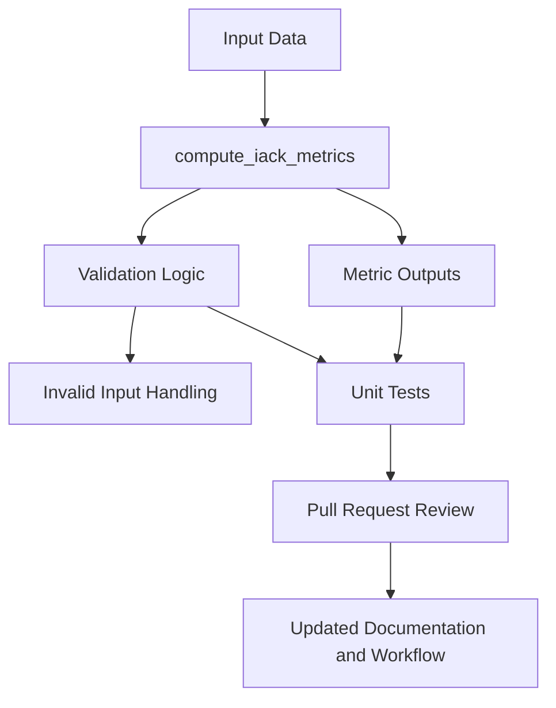

# IACK Framework

IACK is an early-stage, research-oriented cybersecurity framework focused on disciplined, testable development of security metrics and related validation logic. The repository is being shaped intentionally through incremental changes, unit tests, pull-request-based iteration, and a more structured development workflow [web:3933][web:3946].

## Overview

The project is currently in a foundation-building phase. At this stage, the emphasis is on repository organization, metric-related code, validation logic, documentation quality, and contribution pathways that support steady and credible growth [web:4040][web:4044].

## Architecture



This diagram reflects the project’s current structure: input handling, metric computation, validation, testing, and pull-request-based refinement. Mermaid is well suited for repository documentation because GitHub can render Mermaid code blocks directly in Markdown [web:3963][web:3974].

## Current Capabilities

The repository currently supports early validation around metrics behavior, including returning expected keys from `compute_iack_metrics`, checking that metric values are numeric, validating error handling for invalid inputs, and confirming placeholder default metric values through unit tests. These capabilities are still foundational, but they establish an important base for future expansion [web:4040][web:4043].

## Guiding Principles

IACK is being developed with a small set of guiding principles:

- Build incrementally.
- Prefer testable behavior over broad claims.
- Keep the architecture understandable.
- Improve documentation as the implementation evolves.
- Protect technical and intellectual credibility from the beginning [web:3946][web:4044].

As the project grows, these principles may expand into more formal architecture notes, contribution standards, and CI workflows [web:4041][web:4044].

## Getting Started

### Requirements

- Git.
- A local clone of the repository.
- Python 3.x installed locally [web:4040][web:4043].

### Clone the repository

```bash
git clone https://github.com/Anthonybryan2021/iack-framework.git
cd iack-framework
```

### Run the tests

```bash
python -m unittest discover -s tests
```

If the tests pass, the current validation suite should complete successfully [web:4040].

## Development Approach

IACK is being developed in a disciplined incremental manner. The goal is not to move quickly at the expense of rigor, but to let the framework mature in a way that remains coherent, reviewable, and technically credible [web:3933][web:4044].

Changes should be small enough to validate, discuss, and review through pull requests. This approach is especially important while the architecture and metric definitions are still evolving [web:4011][web:4013].

## Roadmap

The roadmap is still evolving, but the current direction can be understood in three phases [web:4044].

### Phase 1: Foundation

- Establish repository structure.
- Stabilize initial metrics and validation logic.
- Expand tests around `compute_iack_metrics`.
- Improve README quality and documentation flow.

### Phase 2: Structure

- Refine metric definitions and assumptions.
- Add architecture notes and supporting documentation.
- Introduce stronger validation and clearer interfaces.
- Begin CI-oriented workflow improvements.

### Phase 3: Growth

- Strengthen contributor guidance.
- Expand documentation for users and collaborators.
- Support deeper experimentation and research use.
- Improve long-term maintainability and academic value [web:4041][web:4043].

## Contribution Intent

At this stage, meaningful contributions may include:

- Architectural feedback.
- Review of metric design and assumptions.
- Testing and validation improvements.
- Documentation refinement.
- Repository organization.
- Academic or research-oriented guidance [web:4041][web:4045].

The project especially welcomes thoughtful contributors who value serious technical work, humility in framing early-stage systems, and integrity in how ideas are developed [web:4044][web:4045].

## How to Contribute

If you are interested in contributing:

1. Review the README and current repository structure.
2. Open an issue or start a discussion around a concrete suggestion.
3. Fork the repository or work from a branch if collaboration access is granted.
4. Submit focused pull requests with clear explanations.
5. Keep changes aligned with the project’s technical and ethical direction [web:4013][web:4041].

As the repository matures, contribution expectations can be formalized further in a dedicated `CONTRIBUTING.md` file [web:4041][web:4045].

## Collaboration

IACK is open to serious collaboration, especially where there is alignment around:

- Cybersecurity research.
- Security metric design.
- Framework architecture.
- Transparent technical development.
- Long-term academic value [web:4041][web:4044].

The project is particularly interested in collaboration that helps strengthen both the technical rigor and the intellectual seriousness of the framework [web:4044].

## Limitations

This repository is still early-stage. That means:

- The architecture is still evolving.
- Metric design is still being refined.
- Current outputs may include placeholder values.
- Documentation is still catching up with the project’s intended direction [web:4040][web:4044].

These limitations are acknowledged openly so that the framework can grow with credibility rather than inflated claims [web:3946][web:4044].

## Why This Project Exists

Many security ideas are discussed at a high level, but fewer are developed in a way that is structured, testable, and reproducible from an early stage. IACK exists to explore a more disciplined path: building a framework carefully, validating it incrementally, and allowing its direction to mature through principled technical work instead of overstated claims [web:3933][web:4040].

## Academic Orientation

Although IACK is still early, part of its long-term aspiration is to become useful not only as a technical repository, but also as work with academic value. This includes the hope that it may eventually support:

- Deeper technical study.
- Clearer security-metric reasoning.
- Collaborative research discussion.
- Future learners or researchers who want to build on an honest and well-structured foundation [web:4043][web:4044].

## License

This project is licensed under the Apache-2.0 License. See the `LICENSE` file for details [web:4043].

## Contact

For collaboration, academic discussion, or technical feedback, please open an issue or use the appropriate project contact channel.

- Email: [felixcepeda@icloud.com](mailto:felixcepeda@icloud.com)
- Phone: 1-647-410-2397

## Repository Notes

- Main repository: [iack-framework](https://github.com/Anthonybryan2021/iack-framework)
- Documentation and contribution structure are expected to evolve over time [web:3933][web:4044].


