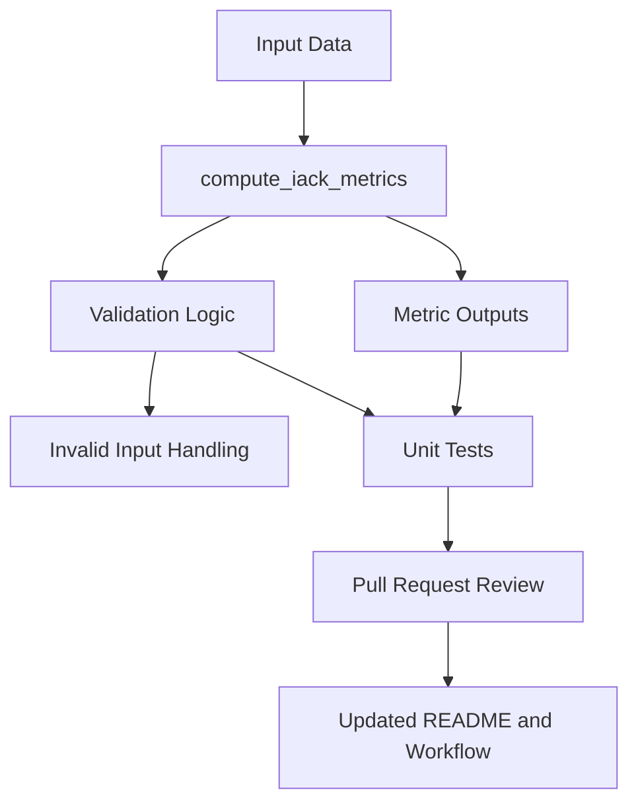

# IACK Framework

IACK is an early-stage, research-oriented cybersecurity framework focused on disciplined, testable development of security metrics and related validation logic. The repository is being shaped intentionally through incremental changes, unit tests, pull-request-based iteration, and a more structured development workflow.

## Architecture



This diagram reflects the current foundation: metric computation, validation, unit tests, and iterative repository improvement. GitHub supports Mermaid diagrams directly in Markdown, so this stays editable and visible in the README itself.

## Current Status

This repository is in an early foundation phase. The current work centers on repository organization, initial metrics-related code, validation logic, and a more structured development workflow built around small, reviewable changes.

## Current Capabilities

The repository currently supports early validation around metrics behavior, including returning expected keys from `compute_iack_metrics`, checking that metric values are numeric, validating error handling for invalid inputs, and confirming placeholder default metric values through unit tests. These capabilities are foundational, but they establish a base for future expansion.

## Guiding Principles

IACK is being developed around a small set of principles:

- Build incrementally.
- Prefer testable behavior over vague claims.
- Keep the architecture understandable.
- Document changes as the project evolves.
- Preserve scientific and technical credibility in the way the framework is described and extended.

As the project grows, these principles may expand into more formal architecture notes, contribution standards, and CI workflows.

## Getting Started

### Requirements

- Git.
- A local clone of the repository.
- Python 3.x installed locally.

### Clone the repository

```bash
git clone https://github.com/Anthonybryan2021/iack-framework.git
cd iack-framework
```

### Run the tests

```bash
python -m unittest discover -s tests
```

If the tests pass, you should see the current validation suite complete successfully.

## Development Approach

IACK is being developed in a disciplined incremental manner. The goal is not speed for its own sake, but a coherent and credible framework that improves through small validated changes. This approach is especially important while metric design and architecture are still being refined. Pull requests should remain focused, reviewable, and narrowly scoped.

## Roadmap

The roadmap is still evolving, but the current direction can be understood in three phases.

### Phase 1: Foundation

- Establish the repository structure.
- Stabilize initial metrics and validation logic.
- Expand tests around `compute_iack_metrics`.
- Improve documentation and contribution pathways.

### Phase 2: Structure

- Refine metric definitions.
- Add architecture notes.
- Introduce stronger validation and more explicit interfaces.
- Begin CI automation.

### Phase 3: Growth

- Formalize contributor guidance.
- Expand documentation for users and collaborators.
- Support more rigorous experimentation and research use.
- Strengthen long-term maintainability.

## Contribution Intent

At this stage, meaningful contributions may include:

- Architectural feedback.
- Review of metric design and assumptions.
- Testing and validation improvements.
- Documentation refinement.
- Repository organization.
- Academic or research-oriented guidance.

The project especially welcomes thoughtful contributors who value serious technical work, humility in framing early-stage systems, and integrity in how ideas are developed.

## How to Contribute

If you are interested in contributing:

1. Review the README and current repository structure.
2. Open an issue or start a discussion around a concrete suggestion.
3. Fork the repository or work from a branch if collaboration access is granted.
4. Submit focused pull requests with clear explanations.
5. Keep changes aligned with the project’s technical and ethical direction.

As the repository matures, contribution guidelines will become more formalized in a dedicated `CONTRIBUTING.md` file.

## Collaboration

IACK is open to serious collaboration, especially where there is alignment around:

- Cybersecurity research.
- Security metric design.
- Framework architecture.
- Transparent technical development.
- Long-term academic value.

The project is particularly interested in collaboration that strengthens both the technical rigor and the intellectual seriousness of the framework.

## Limitations

This repository is still early-stage. That means:

- The architecture is still evolving.
- Metric design is still being refined.
- Current outputs may include placeholder values.
- Documentation is still catching up with the project’s intended direction.

These limitations are acknowledged openly so that the framework can grow with credibility.

## Why This Project Exists

Many security ideas are discussed at a high level, but fewer are developed in a way that is structured, testable, and reproducible from an early stage. IACK exists to explore a more disciplined path: building a framework carefully, validating it incrementally, and allowing its direction to mature through principled technical work instead of inflated claims.

## Academic Orientation

Although IACK is still early, part of its long-term aspiration is to become useful not only as a technical repository, but also as work with academic value. This includes the hope that it may eventually support:

- Deeper technical study.
- Clearer security-metric reasoning.
- Collaborative research discussion.
- Future learners or researchers who want to build on an honest and well-structured foundation.

## License

This project is licensed under the Apache-2.0 License. See the `LICENSE` file for details.

## Contact

For collaboration, academic discussion, or technical feedback, please open an issue or reach out through the appropriate project contact channel.

- Email: felixcepeda@icloud.com
- Phone: 1-647-410-2397

## Repository Notes

- Main repository: [iack-framework](https://github.com/Anthonybryan2021/iack-framework)
- Documentation and contribution structure are expected to evolve over time.


