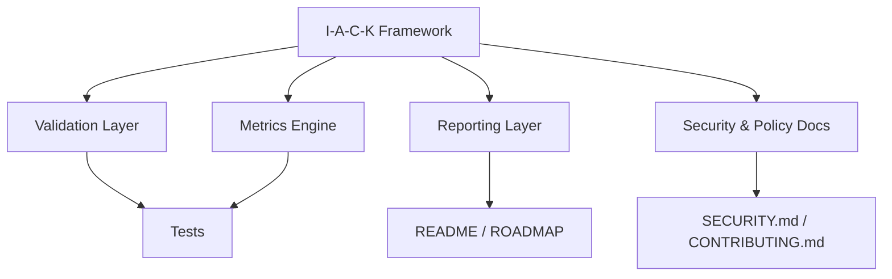

## Overview

I-A-C-K is a mathematical and AI-driven framework for real-time confidentiality proxy measurement in cybersecurity systems.

### What it includes
- Validation and metrics test coverage
- Project documentation and governance files
- Security policy and contribution guidance
- A roadmap for planned framework work

### Key references
- [ROADMAP.md](./ROADMAP.md)
- [SECURITY.md](./SECURITY.md)
- [CONTRIBUTING.md](./CONTRIBUTING.md)
- [LICENSE](./LICENSE)

## Architecture

