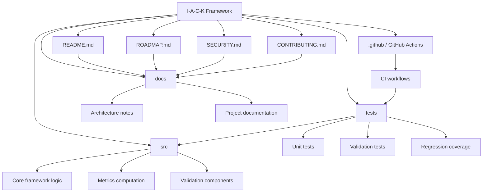

# I-A-C-K Architecture

```mermaid
flowchart TD
    A[I-A-C-K Framework] --> B[src]
    A --> C[tests]
    A --> D[docs]
    A --> E[README.md]
    A --> F[ROADMAP.md]
    A --> G[SECURITY.md]
    A --> H[CONTRIBUTING.md]
    A --> I[.github / GitHub Actions]

    B --> B1[Core framework logic]
    B --> B2[Metrics computation]
    B --> B3[Validation components]

    C --> C1[Unit tests]
    C --> C2[Validation tests]
    C --> C3[Regression coverage]

    D --> D1[Architecture notes]
    D --> D2[Project documentation]

    I --> I1[CI workflows]
    I1 --> C
    C --> B
    E --> D
    F --> D
    G --> D
    H --> D
```
